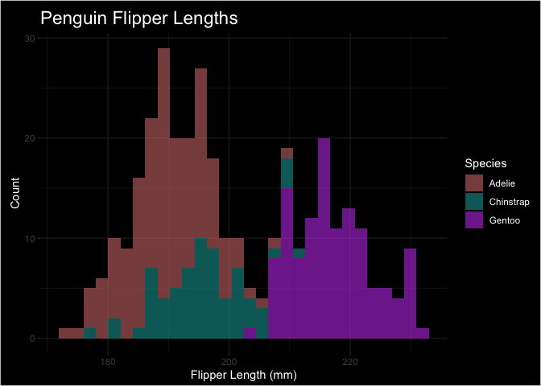
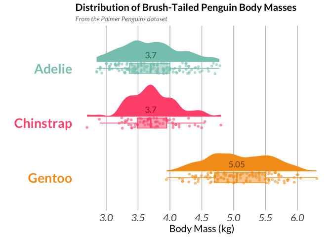

palmer penguins practice
================

``` r
library(palmerpenguins)
library(ggplot2)

penguins <- penguins

flipper_length_plot <- ggplot(penguins, aes(x = flipper_length_mm)) +
                       geom_histogram(aes(fill = species), alpha = 0.6) +
                       scale_fill_manual(values = c("#CE7777", "#10A19D", "#C147E9")) +
                       labs(title = "Penguin Flipper Lengths", x = "Flipper Length (mm)", y = "Count", fill = "Species") +
                       theme(plot.title = element_text(size = 17, color = "white"),
                             axis.title = element_text(color = "white"),
                             legend.title = element_text(color = "white"),
                             legend.text = element_text(color = "white"),
                             panel.background = element_rect(fill = "black"),
                             plot.background = element_rect(fill = "black"),
                             panel.grid = element_line(color = "gray12"),
                             legend.background = element_rect(fill = "black"),
                             legend.key = element_rect(fill = "black"),
                             plot.margin = margin(t = 10, r = 5, b = 5, l = 10)
                             )
flipper_length_plot
```

    ## `stat_bin()` using `bins = 30`. Pick better value with `binwidth`.

    ## Warning: Removed 2 rows containing non-finite values (`stat_bin()`).

<!-- -->

``` r
library(ggdist)
library(tidyverse)
```

    ## ── Attaching packages ─────────────────────────────────────── tidyverse 1.3.2 ──
    ## ✔ tibble  3.1.8      ✔ dplyr   1.0.10
    ## ✔ tidyr   1.2.1      ✔ stringr 1.5.0 
    ## ✔ readr   2.1.3      ✔ forcats 0.5.2 
    ## ✔ purrr   0.3.5      
    ## ── Conflicts ────────────────────────────────────────── tidyverse_conflicts() ──
    ## ✖ dplyr::filter() masks stats::filter()
    ## ✖ dplyr::lag()    masks stats::lag()

``` r
library(colorspace)

penguins_no_na = na.omit(penguins)

cols <- c("#86C8BC", "#FF597B", "#F49D1A")
dark <- c("#234d45", "#740017", "#563504")

body_mass_raincloud <- ggplot(penguins_no_na, aes(x = (body_mass_g/1000), y = fct_rev(species))) +
                       # halfeye plots
                       ggdist::stat_halfeye(
                         adjust = 0.6,
                         width = 0.75,
                         height = 0.65,
                         justification = -0.2,
                         .width = 0, 
                         point_colour = NA,
                         aes(fill = species),
                         alpha = 1
                         ) +
                       # boxplots
                       geom_boxplot(
                         width = 0.185,
                         outlier.shape = NA,
                         aes(fill = species, color = species),
                         alpha = 0.5
                         ) +
                       # scatterplots
                       geom_point(
                         size = 1.3,
                         alpha = 0.5,
                         position = position_jitter(
                           seed = 1, height = 0.1
                         ),
                         aes(color = species)
                       ) +
                       # medians
                       stat_summary(
                         geom = "text",
                         fun = "median",
                         aes(label = round(after_stat(x), 2),
                             color = species,
                             color = after_scale(darken(color, .5, space = "HLS"))),
                         size = 4.5,
                         family = "Lato",
                         vjust = -1.75
                       ) +
                       # titles
                       labs(
                         title = "Distribution of Brush-Tailed Penguin Body Masses",
                         subtitle = "From the Palmer Penguins dataset",
                         x = "Body Mass (kg)",
                         y = "",
                         fill = "Species"
                       ) +
                       theme(
                         # title / subtitle
                         plot.title = element_text(size = 15, family = "Lato", face = "bold"),
                         plot.subtitle = element_text(size = 10, family = "Lato", face = "italic", color = "gray50"),
                         # axis
                         axis.title = element_text(size = 15, family = "Lato", face = "plain"),
                         axis.text.x = element_text(size = 15, family = "Lato", face = "italic"),
                         axis.text.y = element_text(size = 20, family = "Lato", face = "bold", color = rev(c("#86C8BC", "#FF597B", "#F49D1A"))),
                         axis.ticks = element_blank(),
                         # panel / plot
                         panel.background = element_blank(),
                         panel.grid.major.x = element_line(color = "gray"),
                         panel.grid.major.y = element_blank(),
                         panel.grid.minor.x = element_blank(),
                         panel.grid.minor.y = element_blank()
                       ) +
                       # changes fills to predetermined colors
                       scale_fill_manual(
                         values = cols,
                         guide = "none"
                       ) +
                       # changes colors to predetermined colors
                       scale_color_manual(
                         values = cols,
                         guide = "none"
                       ) +
                       scale_x_continuous(
                         breaks = seq(2.5, 6.5, 0.5)
                       )
```

    ## Warning: Duplicated aesthetics after name standardisation: colour

    ## Warning: Vectorized input to `element_text()` is not officially supported.
    ## ℹ Results may be unexpected or may change in future versions of ggplot2.

``` r
body_mass_raincloud
```

    ## Warning: Using the `size` aesthietic with geom_segment was deprecated in ggplot2 3.4.0.
    ## ℹ Please use the `linewidth` aesthetic instead.

<!-- -->
